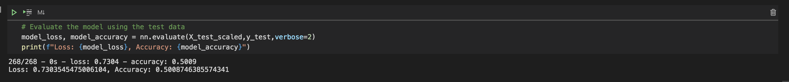
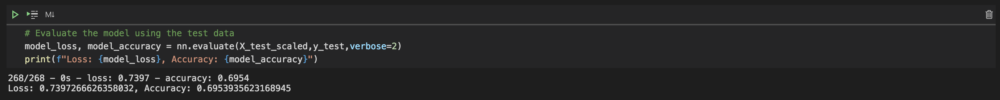

# Neural_Network_Charity_Analysis
 Mop 19 Challenge
## Purpose of the Analysis
The purpose of this analysis is to build a neural network that can accurately predict successful charities funded by AlphabetSoup. 
## Results
### Preprocessing the data
* The first step in our analysis was to clean our data, to enable us to run it through the neural network. We had to decide what our target variable would be as well as what features(inputs) we would use. Our target variable was the Is Successful category, which tracks whether or not the charity was actually successful. For our inputs we used everything except the Name of the charity as well as its EIN, which are both just identification columns. 
### Compiling, Training, and Evaluating the Model
* For our model we used 8 neurons in the first layer and 5 in the second. We used two layers and multiple neurons because this is a complex dataset and we wanted to ensure that we were able to view a variety of different weights and dimensions when looking at the features. We were unable to reach the target of 75%, coming in just shy at 69%. In attempting to optimize the model we added a third hidden layer, changed up the number of neurons, and tried using the SGD optimizer. We also dropped the ASK_AMT column. This raised us from the inital 50% to our final of 69%. 

## Summary
Overall, our Neural Network was just okay in its predictions. With our model accurately predicting successful charities at around 70% of the time, it might be helpful, but not entirely reliable. As this is a binary classifcation issue, we could have looked at a logistic regression test, although that might not fully capture the weight of each of our features. 
